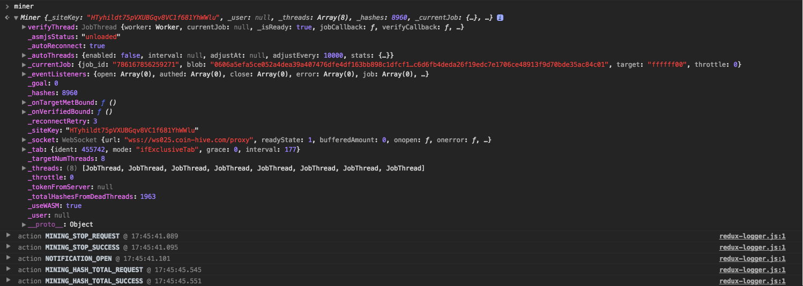

# Harvest - Distributed Browser Blockchain (Monero) | Open Source Specification
Harvest is an Open Source browser based, blockchain implementation, built for Monero.

https://CryptoNote.org/cns/cns008.txt

```

CRYPTONOTE STANDARD 008                                       March 2013


   Rechberger, C., Schlaffer, M., and S. Thomsen, "Groestl - a SHA-3
   candidate", 2011.

   [JH] Wu, H., "The Hash Function JH", 2011.

   [KECCAK] Bertoni, G., Daemen, J., Peeters, M., and G. Van Assche,
   "The Keccak reference", 2011.

   [SKEIN] Ferguson, N., Lucks, S., Schneier, B., Whiting, D., Bellare,
   M., Kohno, T., Callas, J., and J. Walker, "The Skein Hash Function
   Family", 2008.

```

## Why Build Harvest

```
git clone git@github.com:KamesCG/Harvest.git
```

Monero is perfect for mass-adoption. The underlying CryptoNote algorithm is specifically designed for CPUs (compared to GPU or ASIC). Therefore, it's suitable for devices that a vast majority of people already own. In my opinion, it provides a very interesting, and large, niche for the Monero Blockchain.

*Not necessarily for the mining and selling of "currency'.*

I think more interesting applications will evolve from the blockchain.

tl;dr *The CryptoNote hashing algorithm provides characteristic essential for widespread adoption.*

[](https://www.youtube.com/watch?v=7HXeGyLYybI&feature=youtu.be)

[Click To Watch Video Explanation](https://www.youtube.com/watch?v=7HXeGyLYybI&feature=youtu.be)

Harvest, because non-technical people benefit from distributed blockchain technology too. Not necessarily because *"we're going to make hella/wicked amounts of magic internet money mannnn!!"* Even though that's actually pretty interesting too.

**DISCLAIMER:** The Harvest project is intended for educational purposes only. Do not illegally run software on other people's computers without their knowledge or consent. 

The **server code may or may not be publicly released** specifically to deter abuse.

### What Harvest Is Not
Harvest is not meant to enable "evil actors" by leeching off people's computer CPU. 

Truly distributed Blockchain technology, where people choose to opt-in for the right incentives is wayyy more valuable. Mining for pennies in the Browser alone is foolish. Don't do it. Instead organize stable local economic supply chains supported by collectively contributing to shared infrastructure, so we can actually have enough computing power for a distributed blockchain... not a blockchain with a few big empires. That's wack. *We've been there*... ***done that***.

Anyways. I'll get off my soapbox now.

# What We Know
It's possible to mine Monero in the Browser, relatively efficiently, using ASM.js and/or WebAssembly. The performance of Mining in the browser doesn't match native C++ currently. In the future, Browser Virtual Machines will match or come close to native compiled byte-code.

A quick history. Early in 2017 the WebAssembly specification was adopted by all the major browsers. Great news for cryptography. Browser Applications can skip past Javascript, which was built for the DOM , and go straight for the goooood stuff. Low-level byte code.

Fast forward to present day and smart people have realized "ohhh" we can build CPU Miners in the browser now.

https://github.com/holzmaster/node-pr0gramm-miner

https://github.com/holzmaster/pr0gramm-miner-native

Browser Blockchains are pioneering a new terrain for cryptocurrency. It's pretty exciting.

## How It's Built
First, major credit to Coin-Hive. Picking apart every line of the source code was magical. I loved what I saw... Sorry if I broke the Terms of Service. 

Below is my "analysis" of the infrastructure. Moving forward, reference to Harvest is the implementation.

Harvest is organized into multiple Tiers: Miner, JobThread, WebWorker and CryptoNote.

**Miner**: Vanilla Javascript

**JobThread**: WebWorker Dispatcher

**WebWorker**: Bundled WebAssembly/Assembly.js

**CryptoNote**: Hashing Algorithm

## Miner
###### (src/logic/harvest/miner)
The Miner Tier is the application exoskeleton.

It actually does *nothing* in regards to mining. It's responsible for dispatching actions, prompted by the user, to the underlying sectors. Included in the top level miner object is mining statistics: hash rate, total, average, throttle, etc... plus the JobThreads branch.

***The branch of most significant is the JobThreads branch.***

The JobThreads branch is an array of "threads".

Each JobThread is responsible for a WebWorker. The WebWorker contains the embedded CryptoNote algorithm. WebWorkers we're desiged specifically for "multi-threading" in the browser. Similar to how an Operating System has multi-threaded CPU goodness. It's like that. But in the browser.

The single, top level Miner object, is responsibile for monitoring JobThreads: starting, stopping and throttling.

Additionally, the Miner will compose mining statistics (hash count, total hashes) via each JobThread.



#### API
##### Interface

```
.start()
.stop()
.getHashesPerSecond()
.getTotalHashes()
.getAcceptedHashes()
.getAutoThreadsEnabled()
.setAutoThreadsEnabled()
.getThrottle()
.setThrottle()
.getNumThreads()
.setNumThreads()
.hasWASMSupport()
.isRunning()

```
##### Internal

```
._startNow()
._otherTabsRunning()
._updateTabs()
._adjustThreads()
._emit()
._hashString()
._connect()
._onOpen()
._onError()
._onClose()
._setJob()
._onTargetMet()
._send()

```

## JobThread 
###### (src/logic/harvest/jobThread)
JobThread(s) only interface with the child WebWorkers running the CryptoNote hashing algorithm. Each thread(WebWorker) loads a copy of the CryptoNote algorithm. A few simple commands are passed back and forth between the JobThread and the HarvestWASMWrapper.

The JobThread is minimal. **It's a finite state machine of on or off**.

**If off** the WebWorker is waiting for a "hashing job" from WebSockets.

**If on** the CryptoNote Hashing algorithm is running.

The JobThread essentially monitors a state for the following.

The job(hashing algorithm) is either running or it is not. By default it's not running, so the ```_create_CryptoNote()``` function is called. The **"running"** state is enabled. JobThread "knows" to wait for the hashing algorithm to complete. Upon hash completition, the JobThread pipes data via a WebSocket, and toggles (now false) the **"running"** state

The chain is now back at the default state, prompting the whole operation to run again. 

#### API

```
.onReady()
.onReceiveMsg()
.setJob()
.stop()

```
**Developer Question: Finite state machine for handling JobThread?**


Notice: The screenshot is from Coin-Hive for reference. 

## WebWorker(src/logic/harvest/worker)
The Worker(s) ensure mining activity is completed on a stand-alone Javascript thread, separate from the rendering thread used by the Document Object Model(DOM). It attempts to mimic multithreading, so multiple CPU intensive tasks can be handled in parallel.

A "Worker" resides witin the JobThread. Passing mining information backup up the delegation chain. It toggles the running state to indicate when it has completed hashing and requires new mining information.

The Worker is passed a WebAssembly (.wasm) and asm.js ([file].asm.js) bundled together as a Blob. A lightweight HarvestWASMWrapper is also passed within the blob, so we can interact with the CryptoNote hasing via the relayed Worker Meesages.

Blob variables are insert during each user's initilization, which is why we cannot serve a static file. Also, it can't be cross origin.

#### DispatchCenter
The DispatchCenter is resposible for intercepting commands between the Browser interface and WebAssembly execution. Essentially it's the middleware between user and how CPU. Dispatch examples include (but not limited too) starting/stopping mining, setting the number of mining threads, throttle maximum CPU usage, etc...

## CryptoNote 
###### (foundry/smelt/harvest => foundry/compiled/harvest)
The CryptoNote Hashing algorithm is at the core of the Harvest infrastructure.

The difference, compared to desktop, is the byte-code is running inside the Browser Virtual Machine, instead of the Operating Sytem.

For the most part, the same optimizations are being shared between the Browser and Desktop.

WebAssembly provides direct access to a computer's CPU. Normally the gatekeeper is Javascript sandboxed inside the DOM. 

Fortunately, asm.js was the first shortcut introduced by Mozilla several years ago. Now we have direct access, with cross-browser specification implementation. Plus, the added benefit of a secure virtual machine, so things don't *get out of hand*.

The compile target is WebAssembly(modern browsers) and asm.js (backwards compatability) via shared C/C++ code.

***Notice: I am in no way an expert and simply parroting information I've learned from others.***

First, our primary compiling target - WebAssembly.

The most important file in our application is the WebAssembly (harvest.wasm) file. It's responsible for implementing the low-level byte code within the Browser Virtual Machine. The code runs directly within popular browser Javascript Virtual Machine: Chrome V8, Firefox SpiderMonkey and Edge Chakra.

CryptoNote C++ has been compiled into WebAssemby .wasm => .wast for simple demonstration purposes.

The HarvestWASMWrapper is **directly responsible** for calling into the CryptoNote WebAssembly(.wasm) functions.

```
HarvestWASMWrapper.onMessage()

HarvestWASMWrapper.destory()

HarvestWASMWrapper.hexToBytes()

HarvestWASMWrapper.bytesToHex()

HarvestWASMWrapper.meetsTarget()

HarvestWASMWrapper.setJob()

HarvestWASMWrapper.work()

HarvestWASMWrapper.workThrottled()
```

The .wast file format provides a human readable version.

```
 (func $f24 (export "_cryptonight_create") (type $t4) (result i32)
    (call $f56
      (i32.const 1)
      (i32.const 2097552)))
  (func $f25 (export "_cryptonight_destroy") (type $t3) (param $p0 i32)
    (block $B0
      (drop
        (call $f52
          (i32.add
            (get_local $p0)
            (i32.const 2097536))))
      (call $f55
        (get_local $p0))))
  (func $f26 (export "_cryptonight_hash") (type $t6) (param $p0 i32) (param $p1 i32) (param $p2 i32) (param $p3 i32)
    (local $l0 i32) (local $l1 i32) (local $l2 i32) (local $l3 i32) (local $l4 i32) (local $l5 i32) (local $l6 i32) (local $l7 i32) (local $l8 i32) (local $l9 i32) (local $l10 i32) (local $l11 i32) (local $l12 i32) (local $l13 i32) (local $l14 i32) (local $l15 i32) (local $l16 i32) (local $l17 i32) (local $l18 i32) (local $l19 i32) (local $l20 i32) (local $l21 i32) (local $l22 i64) (local $l23 i64)
    (block $B0
      (set_local $l20
        (get_global $g6))
      (set_global $g6
        (i32.add
          (get_global $g6)
          (i32.const 16)))
      (call $f43
        (get_local $p1)
        (get_local $p3)
        (tee_local $l10
          (i32.add
            (get_local $p0)
            (i32.const 2097152))))
      (set_local $p3
        (if $I1 (result i32)
          (tee_local $l5
            (i32.load
              (tee_local $p1
                (i32.add
                  (get_local $p0)
                  (i32.const 2097536)))))
          (then
            (get_local $p1))
          (else
            (i32.store
              (get_local $p1)
              (tee_local $l5
                (call $f50)))
            (get_local $p1))))
```

Second, let's cover asm.js - a statically typed Javascript subset for running efficient Javascript.

For backwards compatabillity the CryptoNote algorithm will be compiled from C++ into "Vanilla" Javascript. For whatever, reasons (possibly security) a Browser may disable WebAssembly. The Hashing output will be limited, but we'll fallback to Javascript.

## Tools
#### WebAssembly
The WebAssembly NPM Package (https://www.npmjs.com/package/webassembly) is a minimimal toolkit for WebAssembly. It's used by the package build scripts to compile the C++ into WebAssembly. In other words, if you want to contribute to the core C++ integration, you'll have to download the WebAssembly toolkit.

Install it globally, because it downloads prebuilt binaries and you'll want it for other projects.
```
npm install -g webassembly 
```

The WebAssembly tier contains high-level Javascript and C++, both in regards to actual code and the amount of tooling required to even begin developing. It's recommend to have to a firm understanding of Javascript, plus be familiar with Object Orientated and Statically Typed programming. 

### Developers
Javascript and C++ developers can get involved by submitting pull-requests. 

#### Emscripten
https://www.npmjs.com/package/require-emscripten
http://kripken.github.io/emscripten-site/docs/getting_started/Tutorial.html

Emscripten is used to compile from C++ to asm.js

#### WebAssembly
http://webassembly.org/

WebAssembly is used to compile from C++ to WebAssebmly (.wast and .wasm)

Note: The Application currently uses "create-react-app" service worker for content-caching. We will definetely be changing that and *embedding our own* ServiceWorker for interface encryption. s
